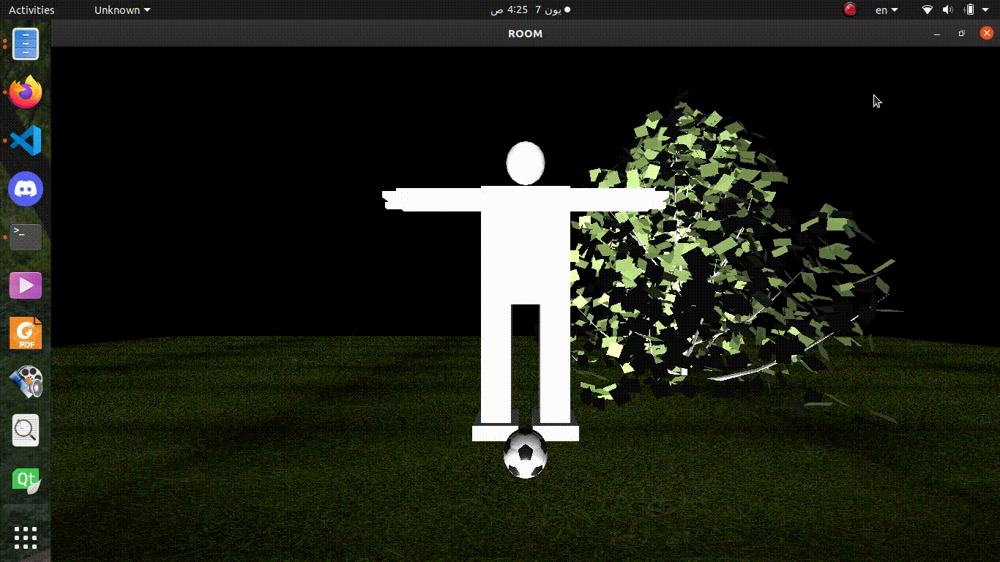
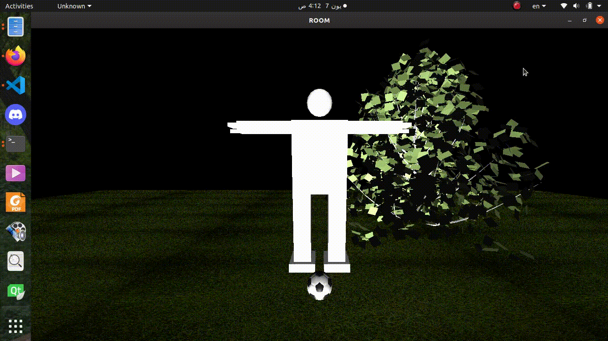
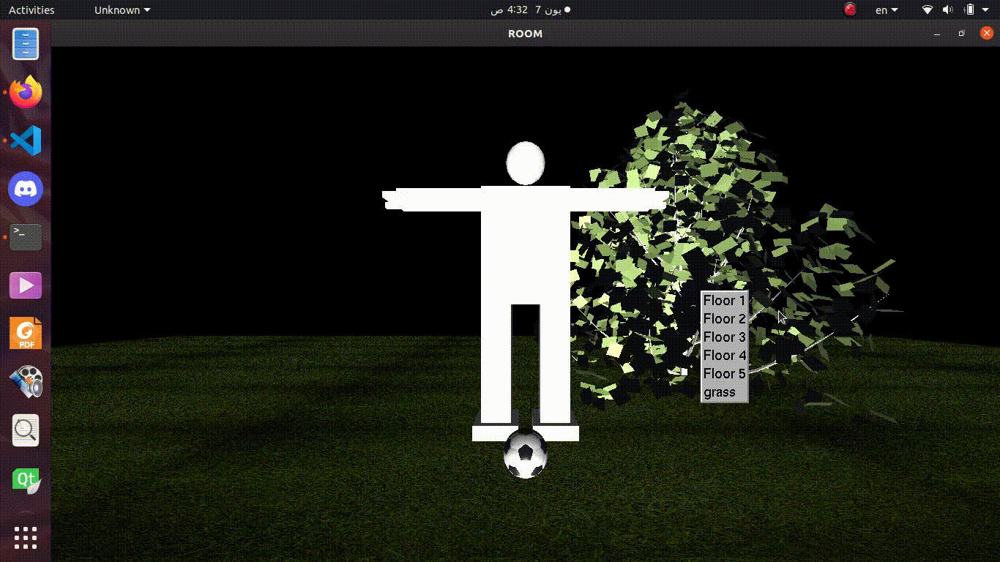

<h1 style="text-align: center;"> Animated Robot and Texture Mapping</h1>

## Table of content

* Task Objectives
* Usage (Keyboard Shortcuts)
* Animations
* Texture Mapping 
* Objects
* Lighting & Color
* Issues

## Task Objectives
The main target of this project is:
* Applying  different types of animations to a full-robotic body.
* Loading different external objects.
* Applying texture mapping to the floor with different options.
* Applying Lighting & Coloring concept
* Make an interaction between the robotic body and an object.

## Description
Design a simulation for a full-scene animation for a robotic body. The scene consists of a robotic body standing on a floor and two different objects; a fixed tree and a ball to play with. The target is to animate this body and interact with the ball with some movements to perform an animation process.

There are different types of animation applied in this project, some of them applied on the robot itself, and the other applied with the objects. In the following sections, we will explain each animation movement alone in more details.

## Basic Usage (Keyboard Shortcuts)
Using the keyboard in upper or lower case, you could test the movement of the body and its animation.
##### 1. Animations:
* Wave : `'l'`
* Exercise:`'.'`
* Dance :`'p'`
* Play with the ball :`'y'`

##### 2. Body Transformations:

* *Right leg* : <kbd>k</kbd> <kbd>K</kbd> flexion & extention
* *Right leg*: <kbd>j</kbd> <kbd>J</kbd>  abduction & adduction
* *left leg*: <kbd>l</kbd> <kbd>L</kbd> flexion & extention
* *left leg*  : <kbd>p</kbd> <kbd>P</kbd> abduction & adduction
* *left knee* : <kbd>y</kbd> <kbd>Y</kbd>
* *Right knee* : <kbd>t</kbd> <kbd>T</kbd>
* *Right shoulder* : <kbd>s</kbd> <kbd>S</kbd> abduction & adduction
* *left shoulder* : <kbd>d</kbd> <kbd>D</kbd> abduction & adduction
* *Right elbow* : <kbd>e</kbd> <kbd>E</kbd>
* *left elbow* : <kbd>n</kbd> <kbd>N</kbd>
* *left shoulder rotation* : <kbd>z</kbd> <kbd>Z</kbd>
* *Right shoulder rotation* : <kbd>x</kbd> <kbd>X</kbd>
* *Right hand fingers lower* : <kbd>q</kbd> <kbd>Q</kbd>
* *Right hand fingers upper* : <kbd>W</kbd> <kbd>w</kbd>
* *left hand fingers lower* : <kbd>I</kbd> <kbd>i</kbd>
* *left hand fingers upper* :<kbd>o</kbd><kbd>O</kbd>

 

## Animations
We applied many different types of animations to the whole scene. Some of the animations are related to the body without interacting with any external object and the others by interacting with an external objects such as the ball.

### The basic idea of the animation
The basic idea of applying an animation to a robotic body or to any object is to change its state or its position in different steps and using timer. This will make the scene looks like it's animating.

### Types of animations
- Wave
- Exercise
- Dance 
- Play with the ball (interactions with external objects)

Now lets talk about each type and see how it looks in the following GIFs.
### 1. Wave

### 2. Exercise

### 3. Dance

### 4. Play with ball

## Texture Mapping
We applied six different types of texture with the ability of changing between them using a drop menu pinned to the right mouse button.

Images are saved in a BMP format. Then it's loaded and pinned to it's texture ID, which is then rendered to fit the vertices of the floor square.

## Loading External Objects
As shown from the previous GIFs we uploaded two different objects. Using glm library allows us to load external object files of extension `.obj` which uses `.mtl` files to color the object.

## Lighting & Color
Two Light sources are applied with a diffuse mode and a white light, turning the scene from complete darkness to light.

 

## Issues
| Issue                                                                   | Solution                             |
|-------------------------------------------------------------------------|--------------------------------------|
| Some textures were not showing as they should be as the real JPEG image | Converting the bit depth of the .bmp image from 32 to 24 |
| Linking the animation of the body with the object                       | Calculation of the difference distances between them and some conditions |

## Conclusion
Briefly, the idea of this project is to apply the animation concept on a full-scene with a robotic body standing on a floor using `C++` with `openGL` API, `GLUT` and `GLM` libraries. We applied some features such as animating the robotic body and interacting with a ball.Six textures were added to the scene with an option to choose between anyone of them.
# Animated-Robot-and-Texture-Mapping
